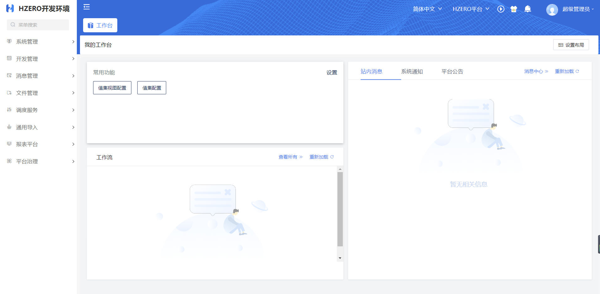
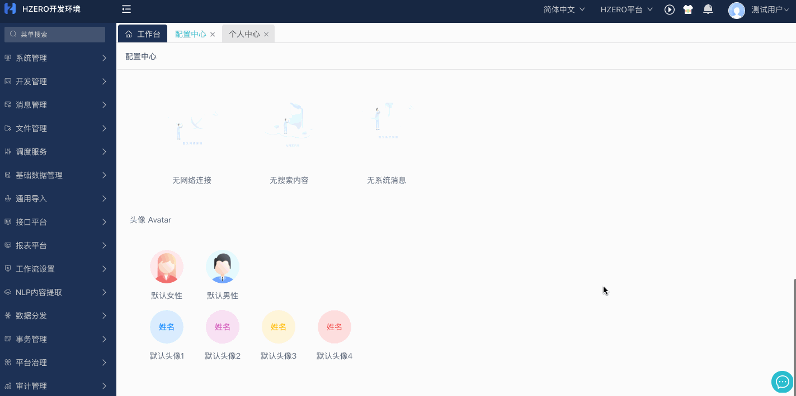
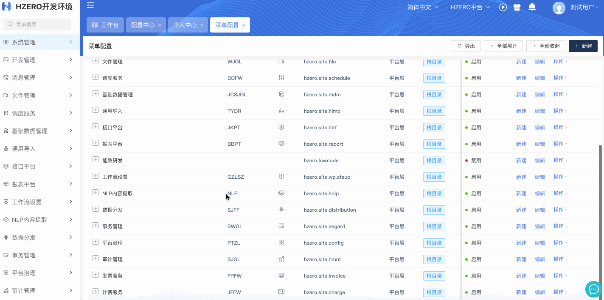
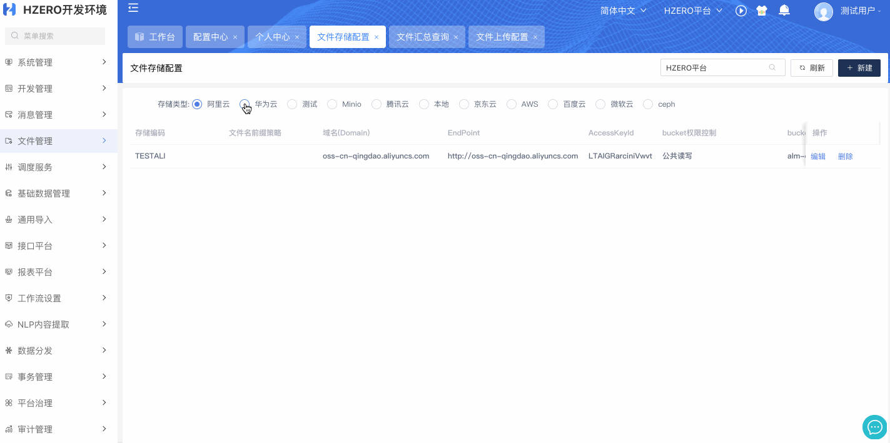
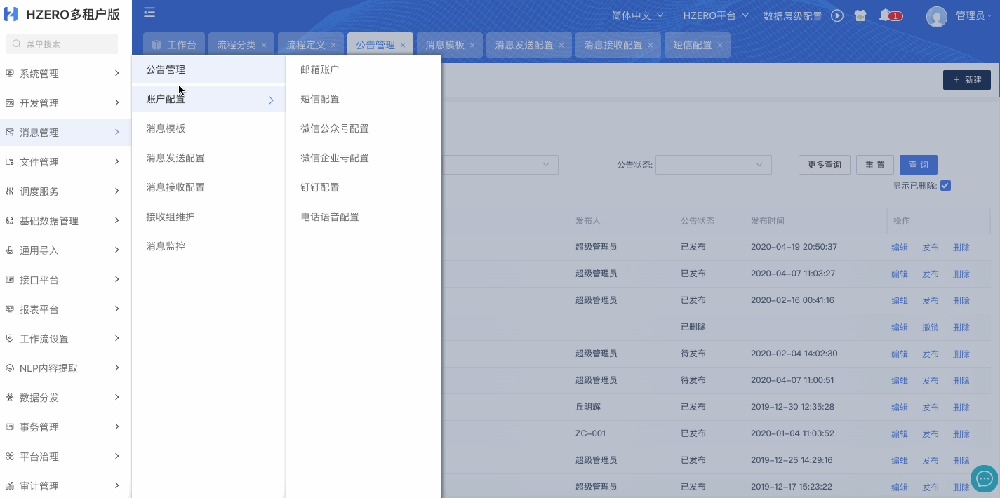
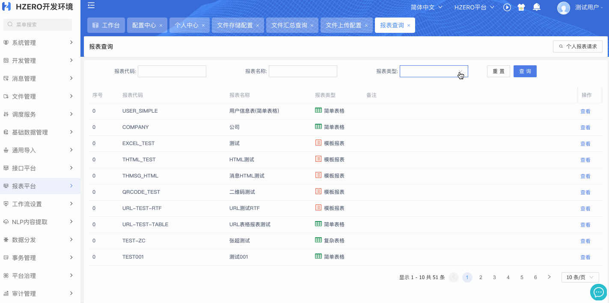

# 系统截图

部分主要开源服务功能的系统截图:

## 首页:

## UI风格切换:
> 可选经典左右或上下菜单结构，提供多种外观皮肤选择，用户可以根据个人喜好自定义每个组件的展现样式

## 菜单角色:
> 在菜单配置下维护好菜单及权限的关系后，才可以在角色管理下进行权限分配与回收。拥有菜单权限集的角色，才可以正常使用该菜单

## 文件管理:
> 目前支持阿里云、华为云、Minio、腾讯云、京东云、AWS、百度云、微软云、ceph九种文件存储服务器外加本地存储，页面会根据服务器的不同自适应参数

## 消息管理:
> 消息模板用于定义及管理消息发送使用的消息模板，配置及管理关联消息发送可关联模板和发送服务器，关联成功后可测试发送消息

## 报表平台:
> 模版类型目前包括Html、Excel、RTF三种类型，在定义报表时可关联模板信息，可在定义后查看运行的详情

