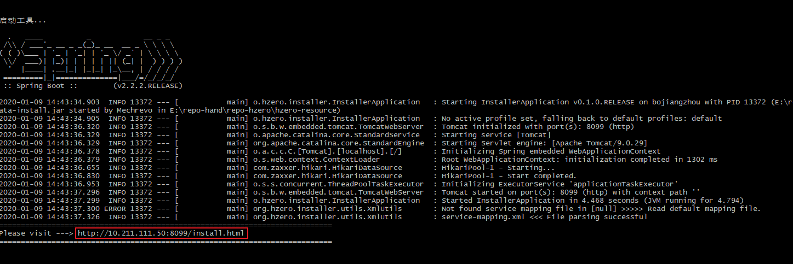
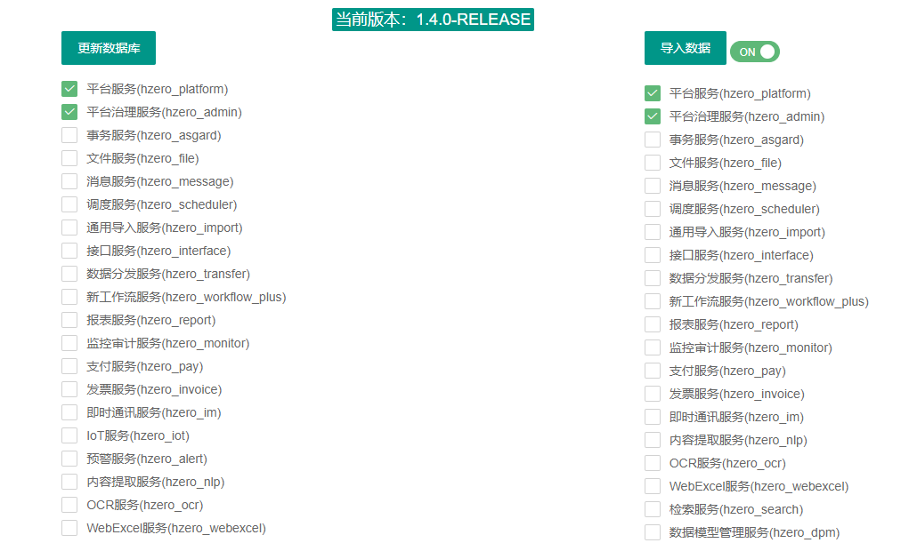

## HZERO 1.5.RELEASE

### 历史版本

* [1.4.0.RELEASE](https://code.choerodon.com.cn/hzero-hzero/hzero-resource/tree/1.4.0.RELEASE)
* [1.3.0.RELEASE](https://code.choerodon.com.cn/hzero-hzero/hzero-resource/tree/1.3.0.RELEASE)
* [1.2.0.RELEASE](https://code.choerodon.com.cn/hzero-hzero/hzero-resource/tree/1.2.0.RELEASE)
* [1.1.0.RELEASE](https://code.choerodon.com.cn/hzero-hzero/hzero-resource/tree/1.1.0.RELEASE)
* [1.0.0.RELEASE](https://code.choerodon.com.cn/hzero-hzero/hzero-resource/tree/1.0.0.RELEASE)
* [0.11.0.RELEASE](https://code.choerodon.com.cn/hzero-hzero/hzero-resource/tree/0.11.0.RELEASE)
* [0.10.0.RELEASE](https://code.choerodon.com.cn/hzero-hzero/hzero-resource/tree/0.10.0.RELEASE)
* [0.9.0.RELEASE](https://code.choerodon.com.cn/hzero-hzero/hzero-resource/tree/0.9.0.RELEASE)
* [0.8.0.RELEASE](https://code.choerodon.com.cn/hzero-hzero/hzero-resource/tree/0.8.0.RELEASE)


### 说明

这个项目中提供了HZERO的初始化内容，包括数据库脚本以及初始数据。

* groovy：表结构 groovy 脚本，提供了每个服务的表结构
* init-data：初始化数据，按服务划分基础数据
* fix-data：数据修复脚本，不同版本升级需要对数据进行的调整
* database-init.sh：交互式执行初始化的脚本


### 初始化工具指南

* hzero-resource 下提供了脚本启动安装工具。

    > 修改application.yml文件中数据库连接参数
    
    * 在根目录下打开 bash 窗口，运行 database-init.sh 脚本
	* 在浏览器中打开输出的地址

    

* 安装页面
	
	* 安装页面展示了当前版本及可以安装的服务和对应的数据，服务后显示的是对应的数据库schema。
	* 首先更新数据库，选择要更新的服务，再点击 `更新数据库` 即可，如果数据库不存在对应的 schema，会自动创建。
	* 数据库更新成功后，选择要更新的数据，再点击 `导入数据` 即可。

	


* Schema不一致处理

	如果数据库 schema 名称与标准的不一致，可以修改 `docs/mapping/service-mapping.xml` 文件中的映射关系

    ```xml
    <!-- name: 服务名; filename: 对应本地文件名;  schema: 安装目标库名，如果与标准库名不同，可修改此属性 -->
	<!-- oracle 分库的情况下，schema 将作为用户名和密码，也可添加 username和password属性分别制定oracle的用户名和密码 -->
    <service name="hzero-platform" filename="hzero_platform" schema="hzero_platform" description="平台服务"/>
    ```

* 合库分库设置

    在 `docs/mapping/service-mapping.xml` 修改如下属性设置安装到一个库或安装到不同库

    ```xmls
    <schema-merge>
        <!-- oracle 默认安装到一个库下，若要分多个库，需设置 merge=false -->
        <oracle merge="true" target-schema="XE" />
        <!-- mysql/sqlsrver 默认安装到不同库下，若要合并到一个库下，可设置 merge=true，target-schema 设置合并的库名，也可以修改所有服务对应的schema -->
        <mysql merge="false" target-schema="" />
        <sqlserver merge="false" target-schema="" />
    </schema-merge>
    ```
